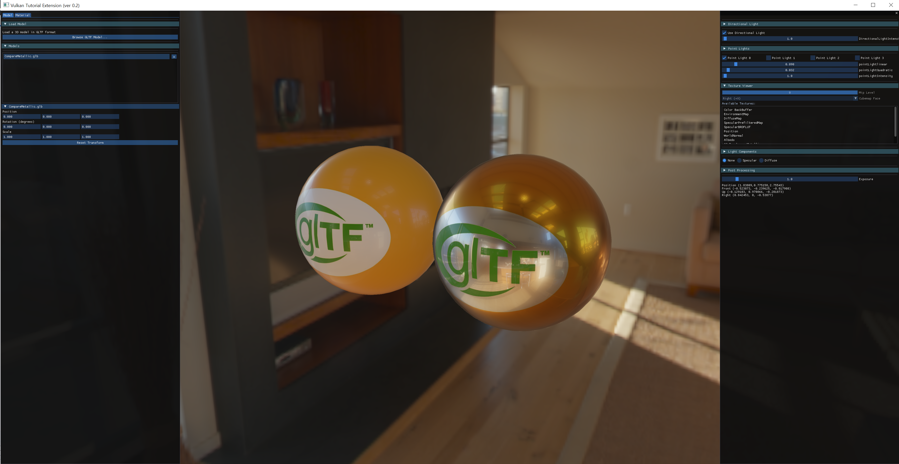
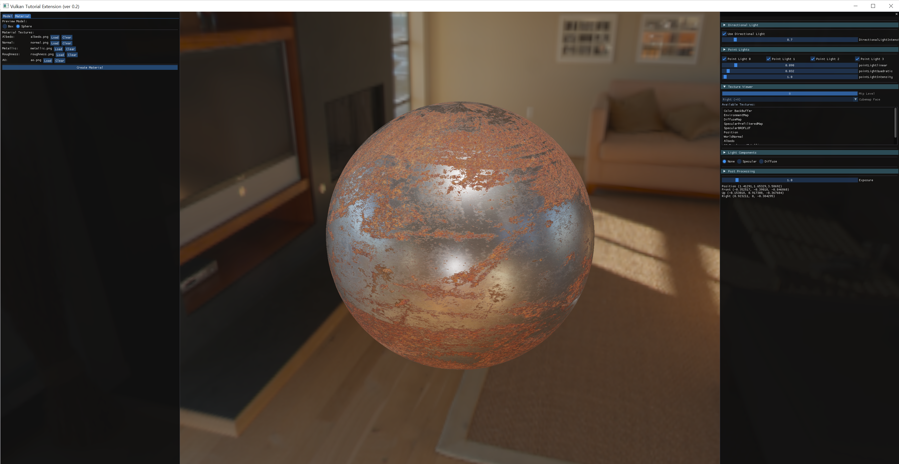
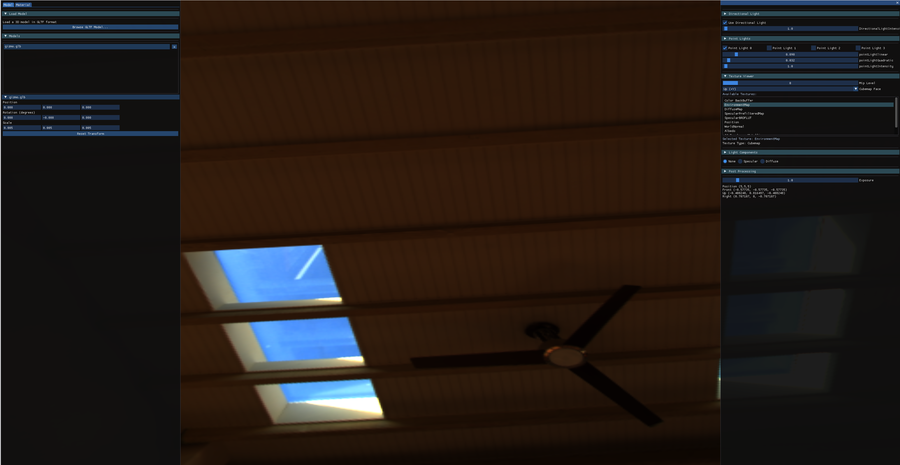
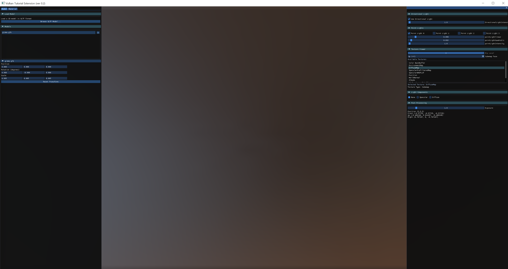
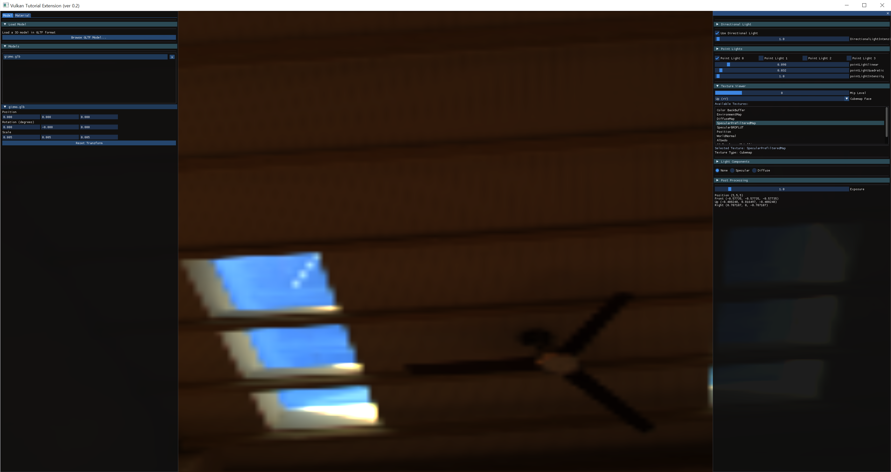

**VulkanTest** is a simple and ongoing sample project extending the Vulkan-Tutorial codebase, designed to add custom features to the Vulkan rendering environment for experimental purposes.

## How to Run

### Option 1: Build from source 
- Ensure Vulkan SDK is installed ([Download Vulkan SDK](https://vulkan.lunarg.com/sdk/home)).
- Build the source code using Visual Studio or your preferred compiler
- Run the compiled executable

### Option 2: Pre-built release
- Download the latest release from the Releases page
- Extract the ZIP file and go x64/Release
- Run VulkanTest.exe

## ver 0.2 PBR

### 1. **glTF Loader**
- Load glTF files to simulate models. 

### 2. **Material Tester**
- Create preview models with PBR material textures for simulation.

### 3. Debug Textures and Light Components
- Debug environment textures, geometry textures, and more. 

#### Environment Map

*Environment map for PBR lighting and skybox*

#### Diffuse Map

*Diffuse map for Indirect Diffuse PBR lighting*

#### Prefiltered Map

*Prefiltered map for Indirect Specular PBR lighting*

## ver 0.1

*Example of rendering instancing and GUI*

### 1. **Rendering Instancing Support**

- Implements instancing to efficiently render multiple objects.
- Adjust the instance count to test performance and experiment with visual effects.

### 2. **Extended Lighting System**

- Supports Point Lights and Directional Lights with real-time adjustments for intensity, attenuation values, and states.
- Manages multiple lights efficiently and visually demonstrates their effects.

### 3. **Camera Control**

- Initializes the camera position and direction.
- Allows camera movement and perspective control through user input.

### 4. **ImGui Integration**

- Provides a simple GUI for real-time adjustments of rendering settings and lighting parameters.
