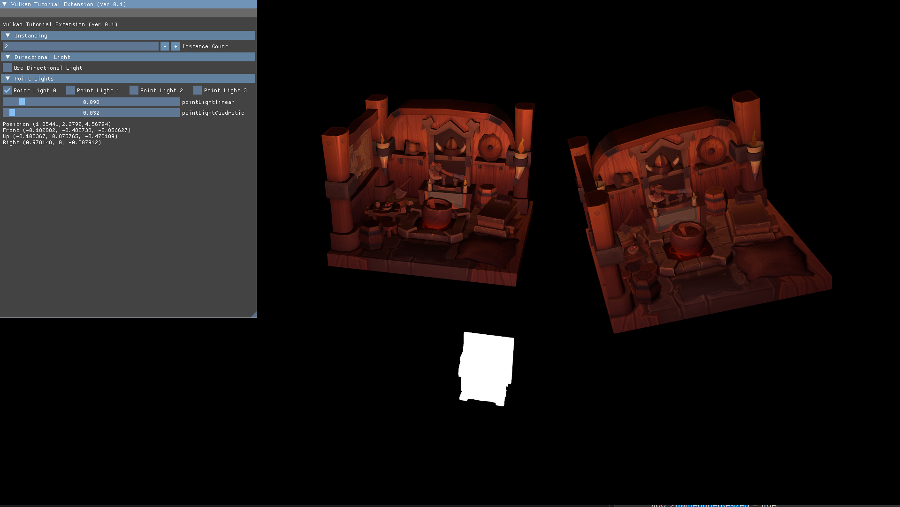

# VulkanTutorialExtension

**VulkanTutorialExtension**은 Vulkan-Tutorial의 코드를 확장하여 작성된 간단한 샘플 프로젝트로, 현재 진행 중인 작업입니다. Vulkan 기반의 렌더링 환경에 사용자 정의 기능을 추가하고 실험적으로 활용하기 위한 목적으로 작성되었습니다. VulkanTutorialExtension.h/.cpp 에 사용자 정의 기능이 구현되어 있습니다.

## 실행 방법

- Vulkan SDK가 설치된 환경에서 실행 ([Vulkan SDK 다운로드](https://vulkan.lunarg.com/sdk/home)).
- 제공된 소스 코드를 빌드한 후 실행 파일을 실행.

## 지금까지 구현된 기능

### 1. **렌더링 인스턴싱 지원**

- 다중 객체를 효율적으로 렌더링하기 위한 인스턴싱 구현.
- 인스턴스 개수를 조정하여 성능 테스트 및 시각적 효과 실험 가능.

### 2. **조명 시스템 확장**

- Point Light와 Directional Light를 지원하며, 각 조명의 강도, 감쇠값, 상태를 실시간으로 변경.
- 다수의 조명을 효율적으로 관리하며, 조명 효과를 시각적으로 확인 가능.

### 3. **카메라 제어**

- 초기 위치와 방향 설정.
- 사용자 입력을 통한 카메라 이동 및 시점 조작.

### 4. **ImGui 통합**

- 간단한 GUI를 제공하여 렌더링 설정 및 조명 파라미터를 실시간으로 조정.

## 실행 화면

*렌더링 인스턴싱 및 GUI 예시*

---

# VulkanTutorialExtension

**VulkanTutorialExtension** is a simple and ongoing sample project extending the Vulkan-Tutorial codebase, designed to add custom features to the Vulkan rendering environment for experimental purposes.

## How to Run

- Ensure Vulkan SDK is installed ([Download Vulkan SDK](https://vulkan.lunarg.com/sdk/home)).
- Build the provided source code and execute the resulting binary.

## Implemented Features

### 1. **Rendering Instancing Support**

- Implements instancing to efficiently render multiple objects.
- Adjust the instance count to test performance and experiment with visual effects.

### 2. **Extended Lighting System**

- Supports Point Lights and Directional Lights with real-time adjustments for intensity, attenuation values, and states.
- Manages multiple lights efficiently and visually demonstrates their effects.

### 3. **Camera Control**

- Initializes the camera position and direction.
- Allows camera movement and perspective control through user input.

### 4. **ImGui Integration**

- Provides a simple GUI for real-time adjustments of rendering settings and lighting parameters.

## Execution Screenshot

*Example of rendering instancing and GUI*

